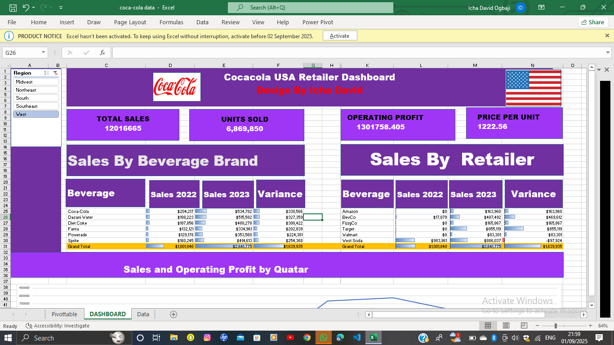
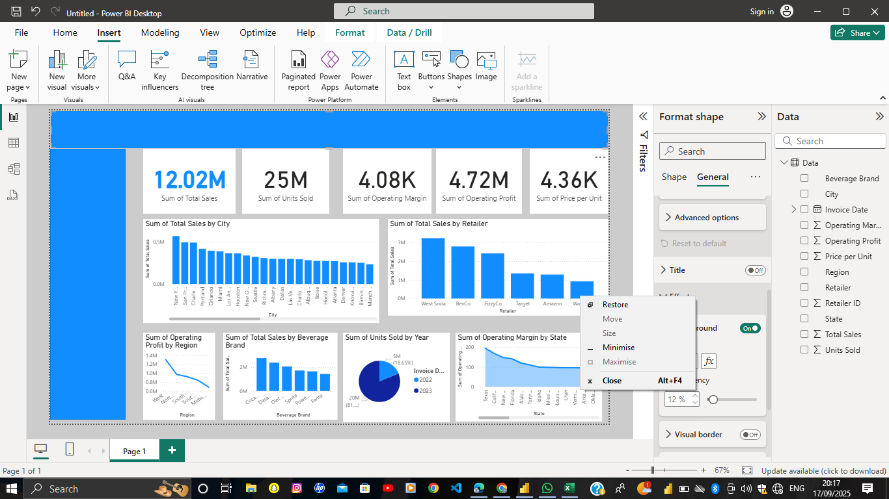

## Hi there 👋, I am David, 
Biochemistry Graduate | Front-End Developer | Data Analyst*

## About

I am a Biochemistry graduate with experience in front-end development and data visualization. My background combines analytical thinking from the sciences with technical skills in web development and business intelligence.

I build dashboards that help organizations understand their data and create web interfaces that prioritize usability.
## Current Focus

- Data Analytics: Power BI dashboards, DAX, Excel
- Front-End Development: HTML, CSS
- Learning: Python, SQL

- 🔭 These are some of the things I have worked on:
  
   
  

